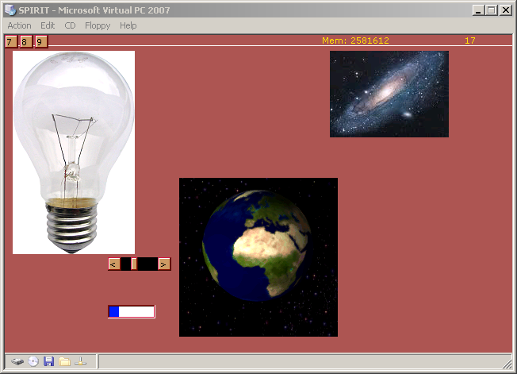
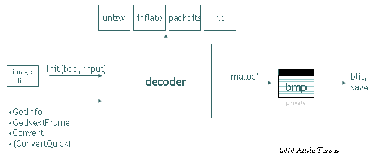

# Image Decoders

During hobby OS development I got the idea to display images of different image compression standards and started to write standalone decoders in C for JPEG, GIF and PNG. This screenshot shows my little *OS* running under Virtual PC and decoding images. The video mode is set programming S3 Trio registers to 16-bpp, 65536-color mode. A lightbulb PNG image, a spinning Earth GIF-animation from Wikipedia and a JPEG galaxy image: 

The idea was to write re-entrant code that outputs images in BM-format, ready to blit into the frame buffer, in different direct-color modes of 15/16/24 and 32-bit per pixel. With a little *header* it becomes a BMP-file, and this is how all the testing was done during development:  

